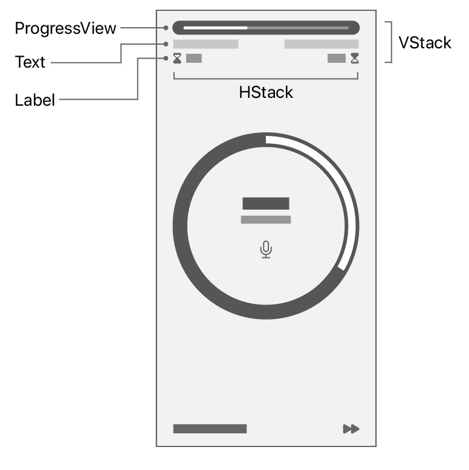

下面是苹果官方给出的使用SwiftUI构建应用的基础教程

原文链接 : [iOS App Dev Tutorials](https://developer.apple.com/tutorials/app-dev-training)

# SwiftUI概述

SwiftUI是一个声明性框架，用于为任何苹果平台构建应用

通过单一语言和公共API，SwiftUI定义应用程序的UI和行为

快速构建apps，主要使用以下SwiftUI的关键功能：

* 声明性语法\-\-使用简单的Swift结构定义屏幕上出现的视图。你的视图会自动更新
* Compositional API--使用内置视图和修改器快速创建和迭代UI。通过组合更简单的视图来组合更复杂的视图
* 强大的布局系统--当现有的视图和控件不满足你的需求时，你可以绘制自己的
* 视图反映了应用程序的数据--定义视图的数据依赖关系，当数据发生变化时，SwiftUI会自动更新视图，避免了无效视图状态造成的错误
* 自动可访问性支持--SwiftUI添加了基本的可访问性，你将学习如何用最少的努力增强这些可访问性

# 从Scrumdinger开始

Scrumdinger是官方给出的一个会议管理应用程序

官方教程手把手一步一步引导我们构建这个程序

## 使用Stacks来排列多个视图

## 创建工程

<div align="center">    

</div>
## 构建一组视图

视图定义了UI的一部分。它们是应用程序的构建块，每个视图都应该小而有重点。你可以通过将小而简单的视图组合起来来构建一个复杂的视图。在本节中，你将构建计时器屏幕头，以显示会议的经过时间和剩余时间

<div align="center">    

</div>

* 第一步，打开**ContentView.swift**文件

  默认的SwiftUI视图文件声明了两个结构。第一个结构遵循`View`协议，该协议有一个要求——返回`View`的`body`属性。在`body`属性中，描述视图的内容、布局和行为。第二个结构声明了要在画布上显示的视图的预览

* 重构`ContentView`

  按住`Control`，点选`ContentView`，选择`Refactor > Rename`将其改名为`MeetingView`以及预览更改为`MeetingView_Previews`

* 将`body`的内容替换为`ProgressView`

  ```swift
  struct MeetingView: View {
      var body: some View {
          ProgressView(value: 5, total: 15)
      }
  }
  ```

* 在右侧画布上点击`resume`展示预览

* 按住`Command`，点选`ProgressView`，选择`Embed in VStack`

  意思是将进度条视图嵌入垂直的栈视图中

* 在代码编辑器中创建一个`HStack`，然后单击`Library`按钮并在`HStack`中拖动一个值为`Seconds Elapsed`的`Text`视图

  无论使用`source editor`、`canvas`、`library`还是`inspectors`来修改视图，代码都保持更新

* 添加另一个`Text`视图，其值为`Seconds Remaining`

* 将每个`Text`视图嵌入`VStack`

  ```swift
  struct MeetingView: View {
      var body: some View {
          VStack {
              ProgressView(value: 5, total: 15)
              HStack {
                  VStack {
                      Text("Seconds Elapsed")
                  }
                  VStack {
                      Text("Seconds Remaining")
                  }
              }
          }
      }
  }
  ```

* 在第一个`Text`视图下面添加一个`Label`，标题为`300`和`systemImage`为`hourglass.bottomhalf.fill`

  图像使用其中一个[SF Symbols](https://developer.apple.com/sf-symbols/)。系统将这些符号视为字体，因此它们可以根据用户的设备设置动态缩放

* 在第二个`Text`视图下方添加一个标题为`600`和`systemImage`为`hourglass.tophalf.fill`的`Label`

  ```swift
  struct MeetingView: View {
      var body: some View {
          VStack {
              ProgressView(value: 5, total: 15)
              HStack {
                  VStack {
                      Text("Seconds Elapsed")
                      Label("300", systemImage: "hourglass.bottomhalf.fill")
                  }
                  VStack {
                      Text("Seconds Remaining")
                      Label("600", systemImage: "hourglass.tophalf.fill")
                  }
              }
          }
      }
  }
  ```

## 修改和样式化视图

* 现在已经在头部视图中创建了基本视图，接下来将创建会议计时器屏幕的其余部分的原型和样式。你将添加内置的修改器来调整标题的外观。你还将创建其他堆栈和视图，并开始添加控件

  <div align="center">    
  
  </div>

* 在每个`VStack`之间添加`Spacer()`以使用父视图的可用空间

  理解为将中间的空间占用、撑开，将左右两边的视图顶到边缘

* 接着添加对齐方式，让两个标题分别头部对齐和尾部对齐

  ```swift
  struct MeetingView: View {
      var body: some View {
          VStack {
              ProgressView(value: 5, total: 15)
              HStack {
                  VStack(alignment: .leading) {
                      Text("Seconds Elapsed")
                      Label("300", systemImage: "hourglass.bottomhalf.fill")
                  }
                  Spacer()
                  VStack(alignment: .trailing) {
                      Text("Seconds Remaining")
                      Label("600", systemImage: "hourglass.tophalf.fill")
                  }
              }
          }
      }
  }
  ```

* 在`Text`视图中添加`.font(.caption)`修饰符，以减小文本的大小

  ```swift
  Text("Seconds Elapsed").font(.caption)
  ```

  现在头部视图有了适当的间距，你将为出现在屏幕中央的计时器环创建一个占位图

* 添加一个带边框的圆形形状作为占位图

  ```swift
  struct MeetingView: View {
      var body: some View {
          VStack {
              ProgressView(value: 5, total: 15)
              HStack {
                  VStack(alignment: .leading) {
                      Text("Seconds Elapsed")
                          .font(.caption)
                      Label("300", systemImage: "hourglass.bottomhalf.fill")
                  }
                  Spacer()
                  VStack(alignment: .trailing) {
                      Text("Seconds Remaining")
                          .font(.caption)
                      Label("600", systemImage: "hourglass.tophalf.fill")
                  }
              }
              Circle()
                  .strokeBorder(lineWidth: 24, antialiased: true)
          }
      }
  }
  ```

* 通过创建页脚来完成会议计时器屏幕的原型设计

  添加一个使用`forward.fill image`的按钮。填充图像作为其标签

  暂时将按钮操作留空。在后面的教程中，将会添加相关操作

  ```swift
  struct MeetingView: View {
      var body: some View {
          VStack {
              ProgressView(value: 5, total: 15)
              HStack {
                  VStack(alignment: .leading) {
                      Text("Seconds Elapsed")
                          .font(.caption)
                      Label("300", systemImage: "hourglass.bottomhalf.fill")
                  }
                  Spacer()
                  VStack(alignment: .trailing) {
                      Text("Seconds Remaining")
                          .font(.caption)
                      Label("600", systemImage: "hourglass.tophalf.fill")
                  }
              }
              Circle()
                  .strokeBorder(lineWidth: 24, antialiased: true)
              HStack {
                  Text("Speaker 1 of 3")
                  Button(action: {}) {
                      Image(systemName: "forward.fill")
                  }
              }
          }
      }
  }
  ```

* 在`Text`视图和按钮之间添加`Spacer`

* 在视图和屏幕边缘之间添加填充，让整个视图四周与屏幕边缘有间距

  ```swift
  .padding()
  ```

## 补充数据的可访问性

* 忽略头部视图中`HStack`子视图的推断可访问性`labels`和`values`

  在接下来的几个步骤中添加补充数据将改进可访问性体验

* 向`HStack`添加一个可访问性标签，并为该标签传递一个有意义的名称

* 将剩余时间的可访问性值添加到`HStack`

* 添加一个可访问性标签来描述按钮

```swift
struct MeetingView: View {
    var body: some View {
        VStack {
            ProgressView(value: 5, total: 15)
            HStack {
                VStack(alignment: .leading) {
                    Text("Seconds Elapsed").font(.caption)
                    Label("300", systemImage: "hourglass.bottomhalf.fill")
                }
                Spacer()
                VStack(alignment: .trailing) {
                    Text("Seconds Remaining").font(.caption)
                    Label("600", systemImage: "hourglass.tophalf.fill")
                }
            }
            .accessibilityElement(children: .ignore)
            .accessibilityLabel(Text("Time remaining"))
            .accessibilityValue(Text("10 minutes"))
            Circle().strokeBorder(lineWidth: 24, antialiased: true)
            HStack {
                Text("Speaker 1 of 3")
                Spacer()
                Button(action: {}) {
                    Image(systemName: "forward.fill")
                }
            }
            .accessibilityLabel(Text("Next speaker"))
        }
        .padding()
    }
}
```

有了这四个修饰符，你就增强了用户的可访问性体验

