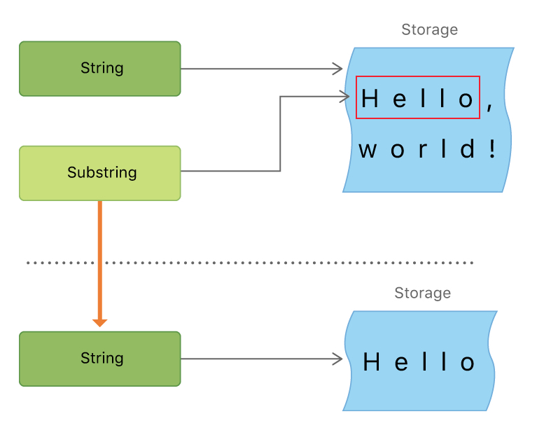

# 多行字符串

使用反斜杆将字符串里面的换行符屏蔽掉

```swift
let softWrappedQuotation = """
The White Rabbit put on his spectacles.  "Where shall I begin,
please your Majesty?" he asked.
"""
print(softWrappedQuotation)

The White Rabbit put on his spectacles.  "Where shall I begin,
please your Majesty?" he asked.
```

```swift
let softWrappedQuotation = """
The White Rabbit put on his spectacles.  "Where shall I begin,\
please your Majesty?" he asked.
"""
print(softWrappedQuotation)

The White Rabbit put on his spectacles.  "Where shall I begin,please your Majesty?" he asked.
```

看下面的缩进

```swift
let quotation = """
		The White Rabbit put on his spectacles.  "Where shall I begin,
				please your Majesty?" he asked.
                
		"Begin at the beginning," the King said gravely, "and go on
		till you come to the end; then stop."
		"""
print(quotation)

The White Rabbit put on his spectacles.  "Where shall I begin,
    please your Majesty?" he asked.

"Begin at the beginning," the King said gravely, "and go on
till you come to the end; then stop."
```

# 空字符串

```swift
var emptyString = ""               // empty string literal
var anotherEmptyString = String()  // initializer syntax
// 以上等价
```

# 字符串是值类型

**Swift 的 String类型是一种值类型。如果你创建了一个新的 String值， String值在传递给方法或者函数的时候会被复制过去，还有赋值给常量或者变量的时候也是一样**。**每一次赋值和传递，现存的 String值都会被复制一次，传递走的是拷贝而不是原本**

**Swift 的默认拷贝 String行为保证了当一个方法或者函数传给你一个 String值，你就绝对拥有了这个 String值，无需关心它从哪里来。你可以确定你传走的这个字符串除了你自己就不会有别人改变它**

另一方面，Swift 编译器优化了字符串使用的资源，实际上拷贝只会在确实需要的时候才进行。这意味着当你把字符串当做值类型来操作的时候总是能够有用很棒的性能

# 访问和修改字符串

## 字符串索引

每一个 `String`值都有相关的*索引类型*， `String.Index`，它相当于每个 `Character`在字符串中的位置

不同的字符会获得不同的内存空间来储存，所以为了明确哪个 `Character` 在哪个特定的位置，你必须从 `String`的开头或结尾遍历每一个 `Unicode` 标量。因此，`Swift` 的字符串不能通过整数值索引

使用 **startIndex**属性来访问 `String`中第一个 `Character`的位置。 **endIndex**属性就是 `String`中最后一个字符后的位置。所以说，**endIndex**属性并不是字符串下标脚本的合法实际参数。如果 `String`为空，则 **startIndex**与 **endIndex**相等

使用 `index(before:)` 和 `index(after:)` 方法来访问给定索引的前后。要访问给定索引更远的索引，你可以使用`index(_:offsetBy:)` 方法而不是多次调用这两个方法

```swift
let greeting = "Guten Tag!"
greeting[greeting.startIndex]
// G
greeting[greeting.index(before: greeting.endIndex)]
// !
greeting[greeting.index(after: greeting.startIndex)]
// u
let index = greeting.index(greeting.startIndex, offsetBy: 7)
greeting[index]
// a
```

使用 `indices`属性来访问字符串中每个字符的索引

```swift
for index in greeting.indices {
    print("\(greeting[index]) ", terminator: "")
}
// Prints "G u t e n   T a g ! "
```

## 插入和删除

要给字符串的特定索引位置插入字符，使用 `insert(_:at:)`方法，另外要插入另一个字符串的内容到特定的索引，使用`insert(contentsOf:at:)` 方法

```swift
var welcome = "hello"
welcome.insert("!", at: welcome.endIndex)
// welcome now equals "hello!"
 
welcome.insert(contentsOf: " there", at: welcome.index(before: welcome.endIndex))
// welcome now equals "hello there!"
```

要从字符串的特定索引位置移除字符，使用 `remove(at:)`方法，另外要移除一小段特定范围的字符串，使用 `removeSubrange(_:)` 方法：

```swift
welcome.remove(at: welcome.index(before: welcome.endIndex))
// welcome now equals "hello there"
 
let range = welcome.index(welcome.endIndex, offsetBy: -6)..<welcome.endIndex
welcome.removeSubrange(range)
// welcome now equals "hello"
```

# 子字符串

当你获得了一个字符串的子字符串——比如说，使用下标或者类似 `prefix(_:)` 的方法——结果是一个[ Substring](https://developer.apple.com/documentation/swift/substring) 的实例，不是另外一个字符串。`Swift` 中的**子字符串拥有绝大部分字符串所拥有的方法，也就是说你可以用操作字符串相同的方法来操作子字符串**。**总之，与字符串不同，在字符串上执行动作的话你应该使用子字符串执行短期处理**。**当你想要把结果保存得长久一点时，你需要把子字符串转换为String 实例**。比如说：

```swift
let greeting = "Hello, world!"
let index = greeting.index(of: ",") ?? greeting.endIndex
let beginning = greeting[..<index]
// beginning is "Hello"
 
// Convert the result to a String for long-term storage.
let newString = String(beginning)
```

与字符串类似，每一个子字符串都有一块内存区域用来保存组成子字符串的字符。**字符串与子字符串的不同之处在于，作为性能上的优化，子字符串可以重用一部分用来保存原字符串的内存，或者是用来保存其他子字符串的内存**。（字符串也拥有类似的优化，但是如果两个字符串使用相同的内存，它们就是等价的。）**这个性能优化意味着在你修改字符串或者子字符串之前都不需要花费拷贝内存的代价**。如同上面所说的，子字符串并不适合长期保存——因为它们重用了原字符串的内存，只要这个字符串有子字符串在使用中，那么这个字符串就必须一直保存在内存里

在上面的例子中， `greeting` 是一个字符串，也就是说它拥有一块内存保存着组成这个字符串的字符。由于 `beginning` 是 `greeting` 的子字符串，它重用了 `greeting` 所用的内存。不同的是， `newString` 是字符串——当它从子字符串创建时，它就有了自己的内存。下面的图例显示了这些关系：

<div align="center">    

</div>

# 字符串比较

## 字符串和字符相等性 

字符串和字符相等使用"等于"运算符 ( ==) 和"不等"运算符 ( !=)进行检查：

```swift
let quotation = "We're a lot alike, you and I."
let sameQuotation = "We're a lot alike, you and I."
if quotation == sameQuotation {
    print("These two strings are considered equal")
}
// prints "These two strings are considered equal"
```

## 前缀和后缀相等性

要检查一个字符串是否拥有特定的字符串前缀或者后缀，调用字符串的 `hasPrefix(_:)`和 `hasSuffix(_:)`方法，它们两个都会接受一个`String` 类型的实际参数并且返回一个布尔量值

